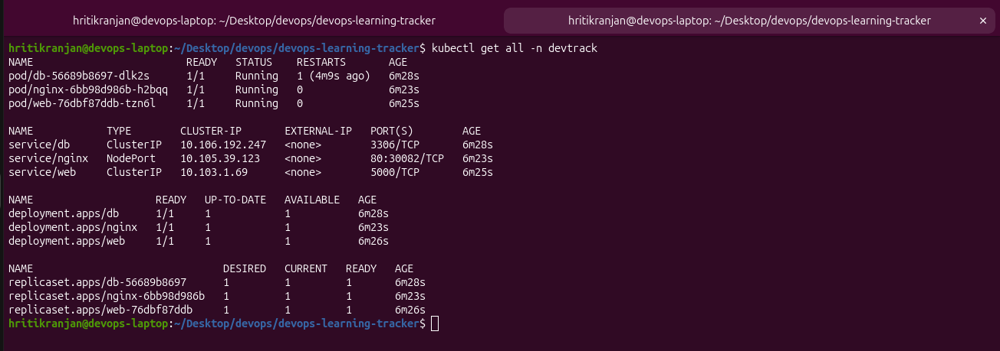
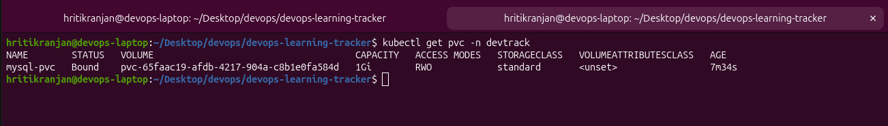
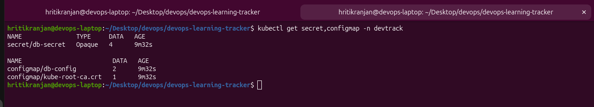
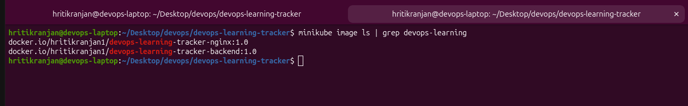
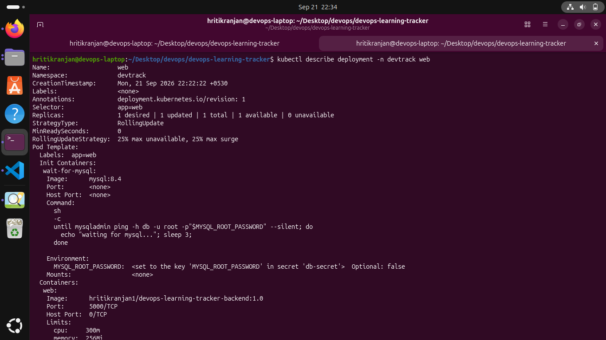
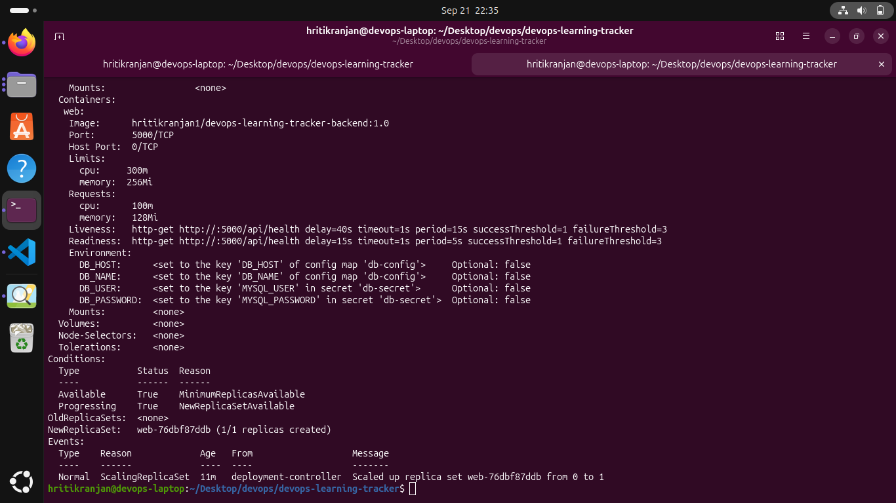
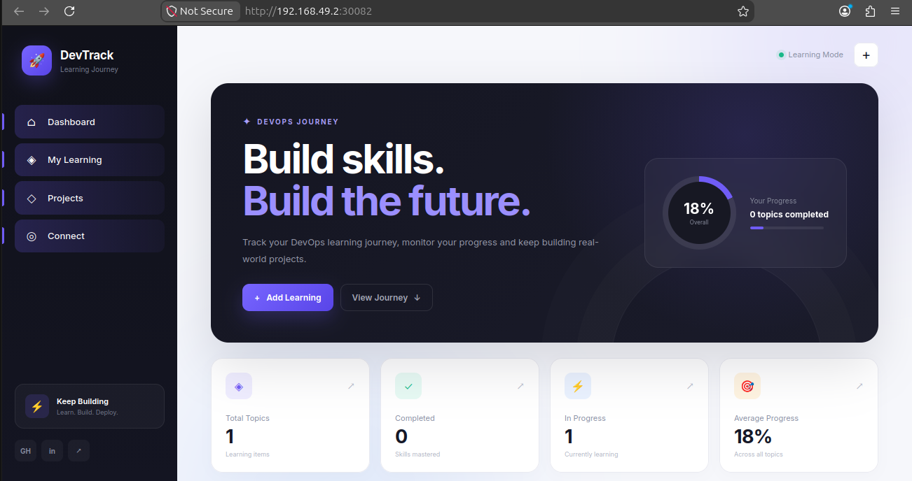
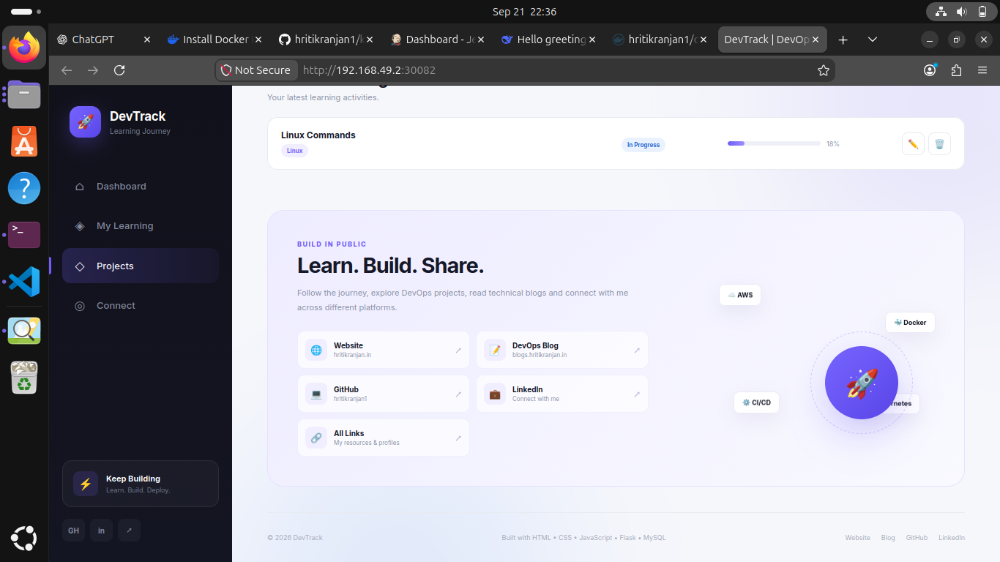
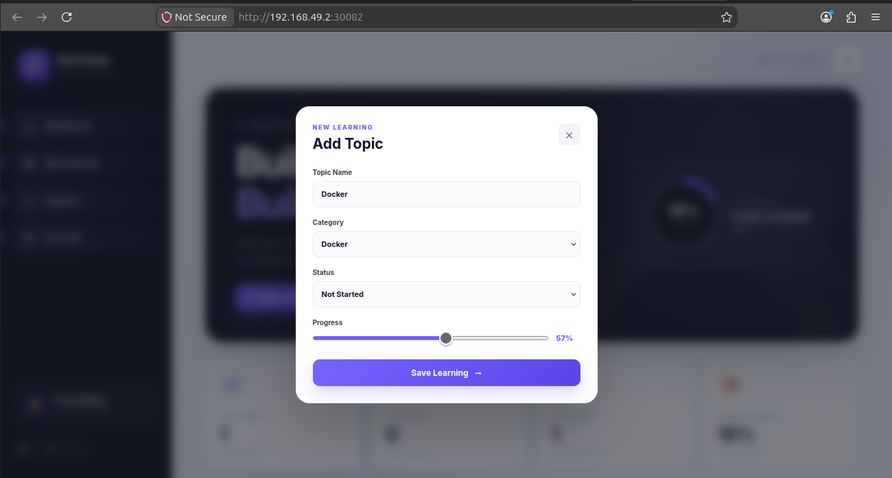

# DevOps Learning Tracker

A production-style **three-tier application** built with **Flask, MySQL, Nginx** and deployed on **Docker Compose** as well as **Kubernetes (Minikube)**.

The purpose of this project is to demonstrate hands-on experience with **containerisation**, **multi-service orchestration**, **database persistence**, **reverse proxy configuration**, **Kubernetes Deployments, Services, PVCs, Secrets, ConfigMaps, Health Probes** and **local cluster deployment using Minikube**.

---


---

## 📘 Detailed User Guide

For a complete step-by-step setup guide (beginner friendly), see [USER_GUIDE.md](./USER_GUIDE.md).

## 📚 Documentation

This project has three main documentation files:

| Document | Description |
|----------|-------------|
| **[README.md](./README.md)** | Project overview, architecture and quick start |
| **[USER_GUIDE.md](./USER_GUIDE.md)** | Complete end-to-end setup guide (beginner friendly) |
| **[ISSUES.md](./ISSUES.md)** | Real issues faced during deployment and how I fixed them |

---


## 📐 Architecture

```text
                        User (Browser)
                              |
                              v
                    +-------------------+
                    |      Nginx        |  <-- Reverse Proxy + Static Files
                    |  (NodePort:30082) |
                    +-------------------+
                              |
                              v
                    +-------------------+
                    |   Flask Backend   |  <-- REST API
                    |  (ClusterIP:5000) |
                    +-------------------+
                              |
                              v
                    +-------------------+
                    |      MySQL        |  <-- Database
                    |  (ClusterIP:3306) |
                    +-------------------+
                              |
                              v
                    +-------------------+
                    | Persistent Volume |  <-- Data Persistence
                    +-------------------+
```

All three services are connected through Kubernetes Services (ClusterIP) inside the same namespace `devtrack`. Only Nginx is exposed to the outside world via **NodePort**.

---

## 🧱 Tech Stack

| Layer | Technology |
|-------|------------|
| Frontend | HTML, CSS, JavaScript |
| Reverse Proxy | Nginx |
| Backend | Python 3, Flask, Flask-CORS |
| Database | MySQL 8.4 |
| Containerisation | Docker, Docker Compose |
| Orchestration | Kubernetes (Minikube) |
| Registry | Docker Hub |
| Persistence | Docker Volume / Kubernetes PVC |

---

## 📁 Project Structure

```text
devops-learning-tracker/
├── backend/
│   ├── app.py
│   ├── requirements.txt
│   └── Dockerfile
├── frontend/
│   ├── index.html
│   ├── style.css
│   └── script.js
├── nginx/
│   ├── nginx.conf
│   └── Dockerfile
├── k8s/
│   ├── 00-namespace.yaml
│   ├── 01-secret.yaml
│   ├── 02-configmap.yaml
│   ├── 03-mysql-pvc.yaml
│   ├── 04-mysql-deployment.yaml
│   ├── 05-mysql-service.yaml
│   ├── 06-backend-deployment.yaml
│   ├── 07-backend-service.yaml
│   ├── 08-nginx-deployment.yaml
│   └── 09-nginx-service.yaml
├── docker-compose.yml
├── .env.example
├── .gitignore
└── README.md
```

---

## 🐳 Part 1 — Running with Docker Compose

### Prerequisites

- Docker Desktop / Docker Engine
- Docker Compose v2

### Environment Setup

```bash
git clone https://github.com/hritikranjan1/devops-learning-tracker-k8s.git
cd devops-learning-tracker-k8s
cp .env.example .env
```

Edit `.env` with your own values:

```env
MYSQL_ROOT_PASSWORD=rootpassword
MYSQL_DATABASE=devops_tracker
MYSQL_USER=devuser
MYSQL_PASSWORD=devpassword
```

### Start

```bash
docker compose up -d --build
```

### Check services

```bash
docker compose ps
```

### Access

```text
http://localhost:8082
```

### Stop

```bash
docker compose down          # stop containers (data safe)
docker compose down -v       # stop + remove volumes (data deleted)
```

---

## ☸️ Part 2 — Running on Kubernetes (Minikube)

### Prerequisites

- Minikube
- kubectl
- Docker (images already pushed to Docker Hub)

### Docker Hub Images

```text
hritikranjan1/devops-learning-tracker-backend:1.0
hritikranjan1/devops-learning-tracker-nginx:1.0
```

MySQL uses the official `mysql:8.4` image.

### Start Minikube

```bash
minikube start --driver=docker --memory=4096 --cpus=2
kubectl get nodes
```

### (Optional but recommended) Load images into Minikube

If your Minikube has network issues pulling from Docker Hub, pre-load the images:

```bash
docker pull hritikranjan1/devops-learning-tracker-backend:1.0
docker pull hritikranjan1/devops-learning-tracker-nginx:1.0
docker pull mysql:8.4

minikube image load hritikranjan1/devops-learning-tracker-backend:1.0
minikube image load hritikranjan1/devops-learning-tracker-nginx:1.0
minikube image load mysql:8.4

minikube image ls | grep devops-learning
```

### Deploy

```bash
kubectl apply -f k8s/
```

Expected output:

```text
namespace/devtrack created
secret/db-secret created
configmap/db-config created
persistentvolumeclaim/mysql-pvc created
deployment.apps/db created
service/db created
deployment.apps/web created
service/web created
deployment.apps/nginx created
service/nginx created
```

### Watch Pods

```bash
kubectl get pods -n devtrack -w
```

Expected (after ~90 seconds):

```text
NAME                     READY   STATUS    RESTARTS   AGE
db-xxxxxx                1/1     Running   0          2m
nginx-xxxxxx             1/1     Running   0          2m
web-xxxxxx               1/1     Running   0          90s
```

### Access the Application

**Option A — Auto-open browser**

```bash
minikube service nginx -n devtrack
```

**Option B — Manual URL**

```bash
minikube ip
# Example: 192.168.49.2
```

Then open in browser:

```text
http://<minikube-ip>:30082
```

### Stop / Clean Up

```bash
# Delete just the application (Minikube stays running)
kubectl delete namespace devtrack

# Stop Minikube
minikube stop

# Delete Minikube cluster
minikube delete
```

---

## 🖼️ Kubernetes Deployment Screenshots

### 1. Pods and Services

```bash
kubectl get all -n devtrack
```



---

### 2. Persistent Volume Claim (Bound)

```bash
kubectl get pvc -n devtrack
```



---

### 3. Secrets and ConfigMaps

```bash
kubectl get secret,configmap -n devtrack
```



---

### 4. Images inside Minikube

```bash
minikube image ls | grep devops-learning
```



---

### 5. Deployment Details

```bash
kubectl describe deployment -n devtrack web
```





---

## 🖥️ Application UI

### Dashboard



### Add Learning Modal



### Learning Added / Progress



---

## 🔐 Environment Variables and Secrets

The application uses the following environment variables:

| Variable | Purpose | Stored As |
|----------|---------|-----------|
| `MYSQL_ROOT_PASSWORD` | MySQL root password | Secret |
| `MYSQL_DATABASE` | Database name | Secret |
| `MYSQL_USER` | Application DB user | Secret |
| `MYSQL_PASSWORD` | Application DB password | Secret |
| `DB_HOST` | MySQL Service name (`db`) | ConfigMap |
| `DB_NAME` | Database name used by Flask | ConfigMap |

- In Docker Compose: values come from `.env`.
- In Kubernetes: values come from `Secret/db-secret` and `ConfigMap/db-config`.
- `.env` is gitignored. Only `.env.example` is committed.

---

## 🔄 Compose → Kubernetes Mapping

| Docker Compose | Kubernetes Equivalent |
|----------------|-----------------------|
| `services.db` | Deployment `db` + PVC `mysql-pvc` + Service `db` |
| `services.web` | Deployment `web` + Service `web` |
| `services.nginx` | Deployment `nginx` + Service `nginx` (NodePort 30082) |
| `.env` variables | Secret `db-secret` + ConfigMap `db-config` |
| `mysql_data` volume | PersistentVolumeClaim `mysql-pvc` |
| `devops_network` | Kubernetes Service DNS (automatic) |
| `depends_on: service_healthy` | `initContainer` polling `mysqladmin ping` |
| `mem_limit: 512m` | `resources.limits.memory: 512Mi` |
| `healthcheck` | `readinessProbe` + `livenessProbe` |
| `ports: "8082:80"` | `Service type: NodePort, nodePort: 30082` |

---

## 🗄️ Database Readiness

### Docker Compose

MySQL has a `healthcheck` using `mysqladmin ping`. Flask waits for `condition: service_healthy`.

### Kubernetes

Because Kubernetes `depends_on` does not exist, an **initContainer** is used in the Flask Deployment:

```yaml
initContainers:
  - name: wait-for-mysql
    image: mysql:8.4
    command:
      - sh
      - -c
      - |
        until mysqladmin ping -h db -u root -p"$MYSQL_ROOT_PASSWORD" --silent; do
          echo "waiting for mysql..."; sleep 3;
        done
```

This guarantees the Flask container only starts **after** MySQL is accepting connections.

---

## 💾 Data Persistence

### Docker Compose

```yaml
volumes:
  - mysql_data:/var/lib/mysql
```

Data survives `docker compose down` and `docker compose up`. Only `docker compose down -v` removes the volume.

### Kubernetes

```yaml
volumeMounts:
  - name: mysql-data
    mountPath: /var/lib/mysql
volumes:
  - name: mysql-data
    persistentVolumeClaim:
      claimName: mysql-pvc
```

Data survives pod restarts, pod deletions and full Deployment re-applications.

**Test persistence on Kubernetes:**

```bash
kubectl delete pod -n devtrack -l app=db
kubectl get pods -n devtrack -w
kubectl exec -it -n devtrack deploy/db -- \
  mysql -u devuser -pdevpassword devops_tracker -e "SELECT * FROM learning_items;"
```

The data is still there — proving PVC persistence.

---

## 🔒 Security Best Practices Implemented

- Database credentials stored in `.env` (Compose) and `Secret` (Kubernetes).
- `.env` included in `.gitignore`.
- `.env.example` contains only placeholder values.
- DB credentials were removed from Git history.
- Flask app runs as a **non-root user** inside the container.
- Nginx is the only service exposed externally (via NodePort).
- MySQL and Flask Services are `ClusterIP` — not directly reachable from outside.
- Resource limits prevent one service from starving others.

---

## ⚙️ Resource Limits

| Service | Docker Compose | Kubernetes |
|---------|----------------|------------|
| MySQL | 512 MB | `requests: 256Mi`, `limits: 512Mi` |
| Flask | 256 MB | `requests: 128Mi`, `limits: 256Mi` |
| Nginx | 128 MB | `requests: 64Mi`, `limits: 128Mi` |

MySQL gets more memory because it is the database. Flask and Nginx handle light workloads.

---

## 🩺 Health Probes

### MySQL

- **Readiness:** `mysqladmin ping` every 5s after 20s delay.
- **Liveness:** `mysqladmin ping` every 15s after 60s delay.
- **Why 60s delay?** MySQL needs time to initialise the data directory on first start. If the liveness probe fires too early, it kills MySQL mid-initialisation and corrupts the InnoDB redo logs.

### Flask

- **Readiness & Liveness:** HTTP GET `/api/health` returns `{"status":"healthy","service":"flask"}`.

### Nginx

- **Readiness:** HTTP GET `/` on port 80.

---

## 🐛 Kubernetes Gotchas — Real Issues I Faced & Fixed

These are the exact issues I hit while migrating from Docker Compose to Minikube, and how I fixed them:

### 1. `ErrImagePull` / `ImagePullBackOff`

**Cause:** Minikube DNS did not resolve Docker Hub from inside the cluster.
**Fix:** Pre-loaded images using `minikube image load <image>` and set `imagePullPolicy: IfNotPresent`.

### 2. `CreateContainerConfigError` — `secret "db-secret" not found`

**Cause:** `01-secret.yaml` was not applied initially (or missing namespace).
**Fix:** Created the Secret with the correct namespace:

```yaml
metadata:
  name: db-secret
  namespace: devtrack
```

### 3. MySQL CrashLoopBackOff — `InnoDB: data files are corrupt`

**Cause:** MySQL was killed mid-initialisation by the liveness probe. The PVC contained partial redo logs which MySQL refused to recover from.
**Fix:**
- Increased `livenessProbe.initialDelaySeconds` to 60.
- Added `strategy: Recreate` in the MySQL Deployment.
- Added `securityContext.fsGroup: 999` so the `mysql` user (UID 999) could write to the PVC.
- Deleted the corrupted PVC and recreated it.

### 4. PVC Permission Denied

**Cause:** PVC was mounted with `root:root` ownership while the MySQL container runs as UID 999.
**Fix:** Added `securityContext: { fsGroup: 999 }` at the pod level.

### 5. Nginx 502 Bad Gateway

**Cause:** Nginx started before Flask was ready.
**Fix:** This was solved by the Flask readiness probe — once `/api/health` returns 200, the endpoint is registered and Nginx can proxy to it.

---

## 🛠️ Useful Kubernetes Commands

```bash
# Pods / Services / Deployments
kubectl get pods -n devtrack
kubectl get svc -n devtrack
kubectl get deployments -n devtrack
kubectl get pvc -n devtrack
kubectl get secret,configmap -n devtrack

# Describe (for debugging)
kubectl describe pod -n devtrack -l app=web
kubectl describe deployment -n devtrack web

# Logs
kubectl logs -n devtrack deploy/web --tail=50 -f
kubectl logs -n devtrack deploy/db --tail=50
kubectl logs -n devtrack deploy/web --previous   # logs of previous crashed pod

# Exec into a pod
kubectl exec -it -n devtrack deploy/web -- sh
kubectl exec -it -n devtrack deploy/db -- mysql -u root -p

# Rollout
kubectl rollout restart deployment/web -n devtrack
kubectl rollout status deployment/web -n devtrack
kubectl rollout undo deployment/web -n devtrack

# Scale
kubectl scale deployment web -n devtrack --replicas=3

# Events (debugging)
kubectl get events -n devtrack --sort-by='.lastTimestamp' | tail -20

# Full cleanup
kubectl delete namespace devtrack
```

---

## 🎯 API Endpoints

| Method | Endpoint | Description |
|--------|----------|-------------|
| GET | `/api/health` | Health check |
| GET | `/api/learning` | List all learning items |
| POST | `/api/learning` | Add a new learning item |
| PUT | `/api/learning/{id}` | Update a learning item |
| DELETE | `/api/learning/{id}` | Delete a learning item |

### Sample Request

```bash
curl -X POST http://<minikube-ip>:30082/api/learning \
  -H "Content-Type: application/json" \
  -d '{"title":"Kubernetes","category":"Kubernetes","status":"In Progress","progress":60}'
```

---

## 🗄️ Database Schema

```sql
CREATE TABLE IF NOT EXISTS learning_items (
    id INT AUTO_INCREMENT PRIMARY KEY,
    title VARCHAR(255) NOT NULL,
    category VARCHAR(100) NOT NULL,
    status VARCHAR(50) NOT NULL,
    progress INT NOT NULL DEFAULT 0,
    created_at TIMESTAMP DEFAULT CURRENT_TIMESTAMP
);
```

---

## 📊 Features

- Add, update and delete learning items
- Track progress (0–100%)
- Filter by category (Linux, Git, Docker, AWS, Kubernetes, CI/CD)
- Status tracking (Not Started, In Progress, Completed)
- Dashboard statistics:
  - Total topics
  - Completed topics
  - Topics in progress
  - Average progress
- Smooth UI with modal, toast notifications and loading animation
- Fully responsive (desktop / tablet / mobile)

---

## ⚠️ Most Awkward Requirement

The most awkward part of this project was getting the complete stack to start correctly from Docker Compose **and then migrating it to Kubernetes**.

**Docker Compose issues:**
- Flask build context was misconfigured.
- Nginx host port conflicted with an existing service.
- Fixed by adjusting the build context and changing the host port to `8082`.

**Kubernetes (Minikube) issues:**
- Images failed to pull from Docker Hub inside Minikube → fixed using `minikube image load`.
- `db-secret` was missing → pods entered `CreateContainerConfigError`.
- MySQL corrupted its InnoDB redo logs because the liveness probe killed it during first-time initialisation → fixed by increasing `initialDelaySeconds` to 60 and adding `securityContext.fsGroup: 999`.
- Had to delete and recreate the PVC to clean the corrupted data.

Each of these required reading Kubernetes events (`kubectl describe pod`), inspecting container logs (`kubectl logs --previous`) and reasoning about container lifecycle — which is exactly the DevOps skill set this project was meant to practise.

---

## 🚀 Future Improvements

- Add **Ingress** instead of NodePort for cleaner URLs
- Add **HorizontalPodAutoscaler** for the Flask service
- Convert the entire stack to a **Helm chart**
- Add **GitHub Actions CI/CD** to build → push → deploy automatically
- Add **Prometheus + Grafana** monitoring via Helm
- Use a **StatefulSet** for MySQL in production
- Add **NetworkPolicy** to restrict pod-to-pod traffic

---

## 👨‍💻 Author

**Hritik Ranjan**
DevOps & Cloud Learner

- GitHub: https://github.com/hritikranjan1
- LinkedIn: https://www.linkedin.com/in/hritikranjan1/
- Blog: https://blogs.hritikranjan.in
- Website: https://hritikranjan.in
- All Links: https://hritik-links.vercel.app

---

## 📄 License

This project is created for learning and portfolio purposes.